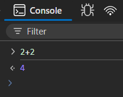
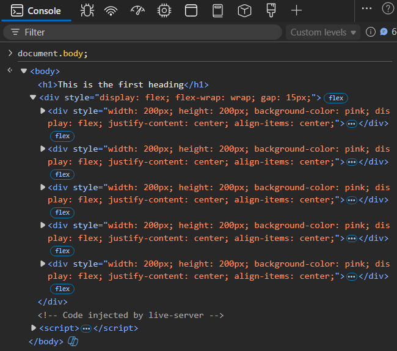
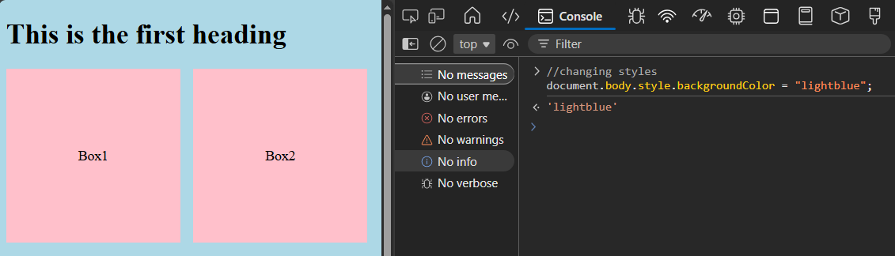
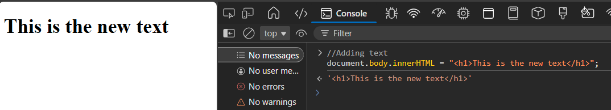

## Running js code snippets directly in console
### 1. Sum of number (2+2)


### 2. document.body
- document.body is the `<body>` of the webpage
- It can access the whole body of the webpage
- It can be used to add , remove, style and add content to the page



### 2.1 Changing background color
- Background color of the page changes instantly.


### 2.2 Adding new text
`document.body.innerHTML = "<p>This is the new text</p>";`
-new paragraph appears on the page.


### 2.3 Creating new element
- New DOM element can be created and inserted using
```js
let p = document.createElement("p");
 p.textContent = "Created via console";
 document.body.appendChild(p);
 ```
- Adds new paragraph to the page.


### 2.4 Event listener
- Alert pops up when the body is clicked.

