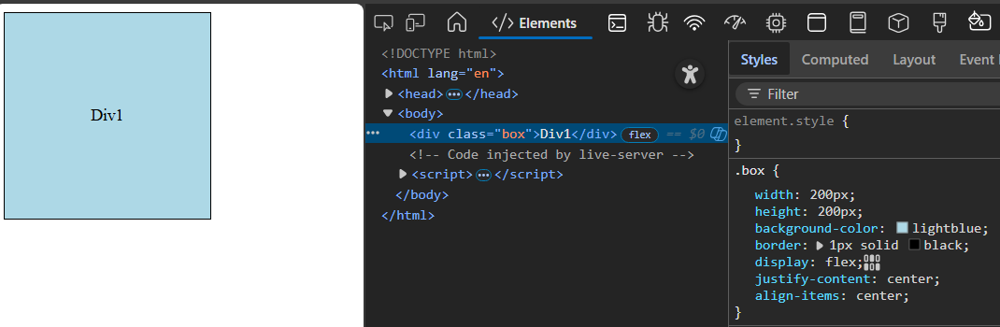
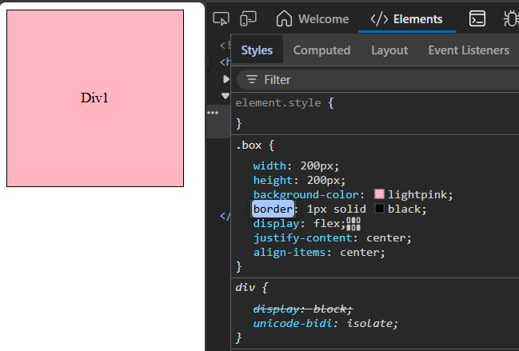
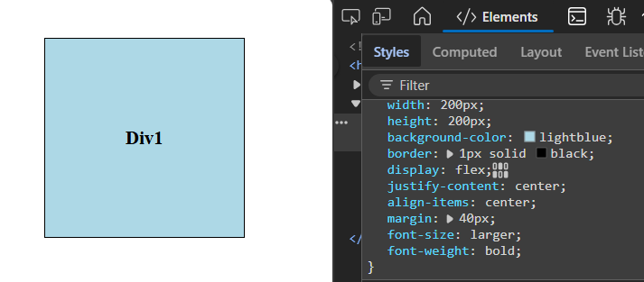
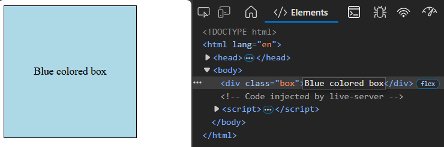
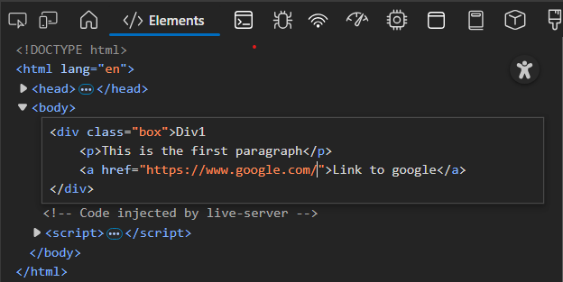
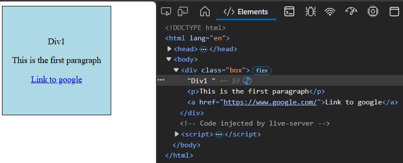
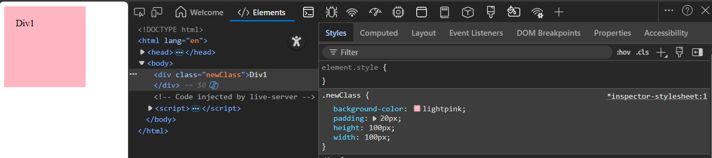

## Use of element panel
**Original div**

1. **Change in background color**

- previous : background-color: lightblue
- now: background-color: pink

- Also changed the text styling

2. **Changing HTML text**
- previous : Div1
- now : Blue colored box

3. **Adding new html tags**
- right click , edit as html , write new tags
- added new tags like `
` and `<a>` to the div

4. **Adding new class name**
- previous: class name = "box"
- now: class name = "newClass"

- Double click on "class", change name, add styling from style panel

