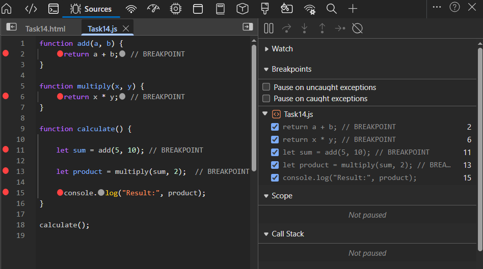
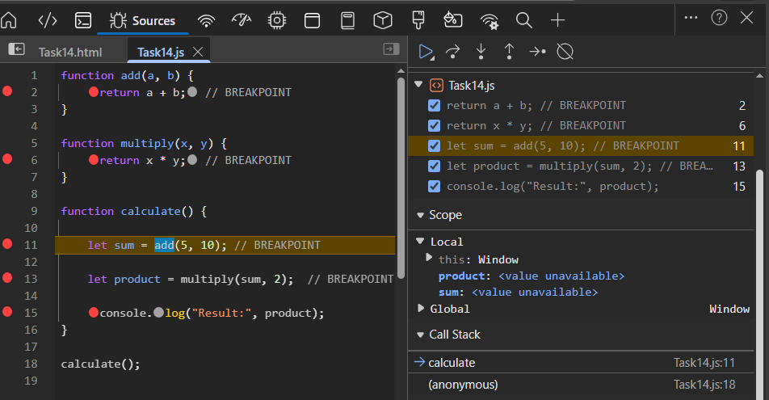
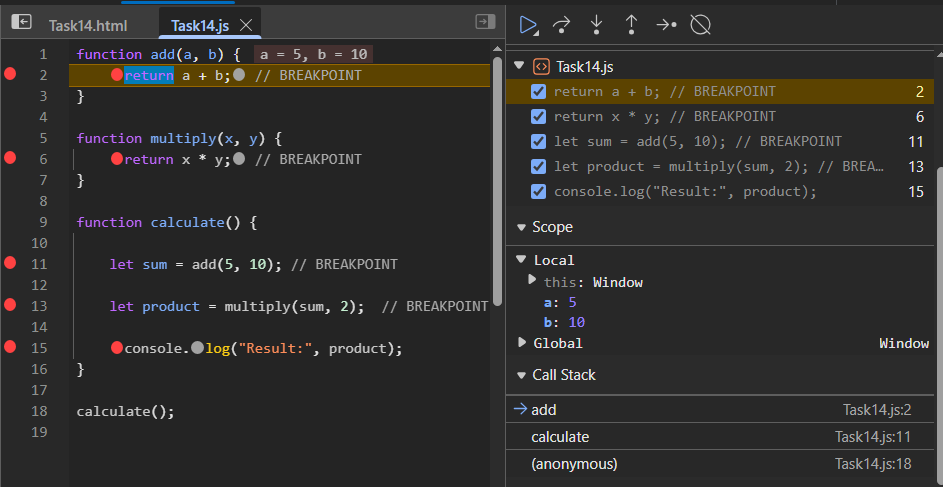
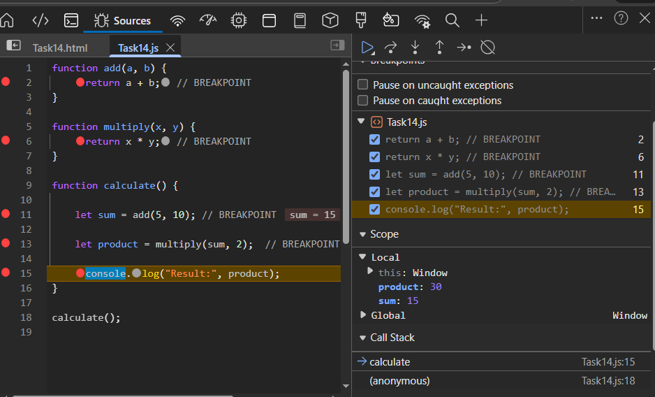

## Breakpoints in JS
- A breakpoint is a pausing point in javascript which pauses the execution to inspect variable and call stack

### Call Stack
- Shows the order of function call.
- Follows LIFO(Last In First Out) order.
- Function at the top gets executed(paused at breakpoints).
- A function is pushed into the stack, when it finishes its operation, it is popped off the stack.

**Applying breakpoints**
- Inspect -> Sources -> Task14.js -> Clicked on the number where breakpoints has to applied.
- Call stack empty.

### 1. The function calculate() is called first and pushed into the stack.

### 2. The add() function is called from the calculate().
- The add() function will be at the top of the stack.

### 3. multiply() function.
- After the add() function gets popped off the stack, multiply() will be at the top.

### 4. Final result.
- Finally the calculate() function finishes and is popped off the stack.

