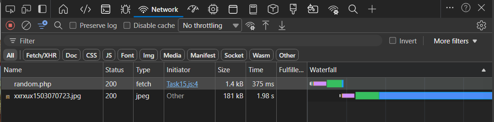
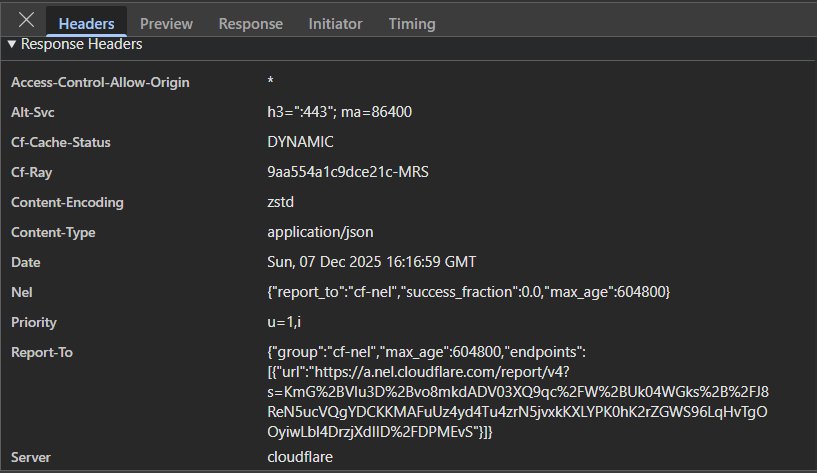
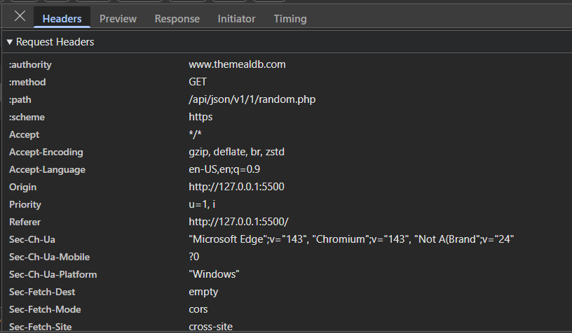

## Use Network tab to inspect a fetch request and its timing.

1. **Header Tab**
- Helps verify if the request was sent correctly and how the server responded.

2. **Response**
- Displays data returned by the server.

3. **Request**
- Contains data sent to the server by the browser

4. **Timing**
- The Timing tab shows how long different stages of the request took.

