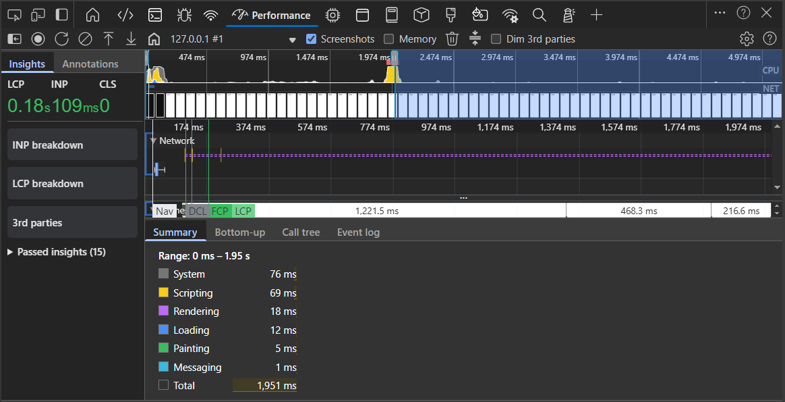
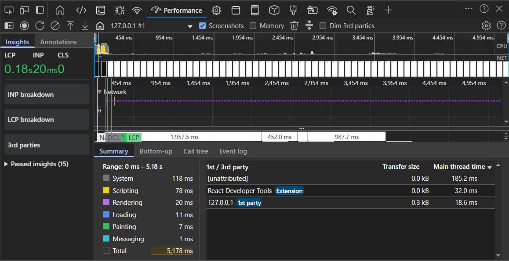

### To analyze JavaScript execution performance using the Performance tab in browser DevTools and compare execution before and after optimizing a loop.

1. **Before optimization**
- A large scripting block appears on the Main thread.
- JavaScript execution occupies most of the timeline.
- High CPU usage due to a loop running 1e8 iterations.
- The page becomes temporarily unresponsive during execution.



- The loop iteration count was reduced to minimize unnecessary computation:

``` js
for (let i = 0; i < 1e6; i++) {
    Math.sqrt(i);
}
```

2. **After Optimization**
- The scripting block is significantly smaller.
- Execution completes much faster.
- Reduced blocking of the main thread.



