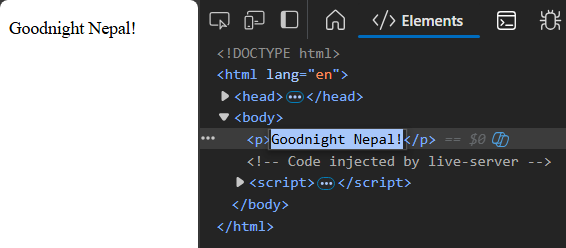
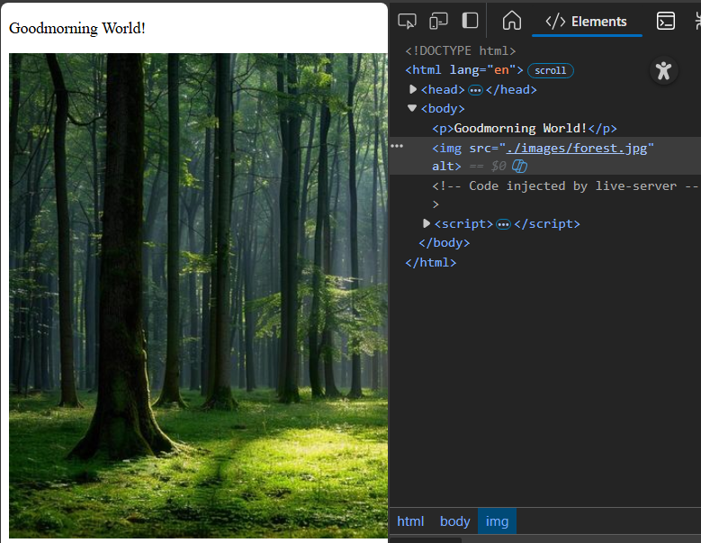
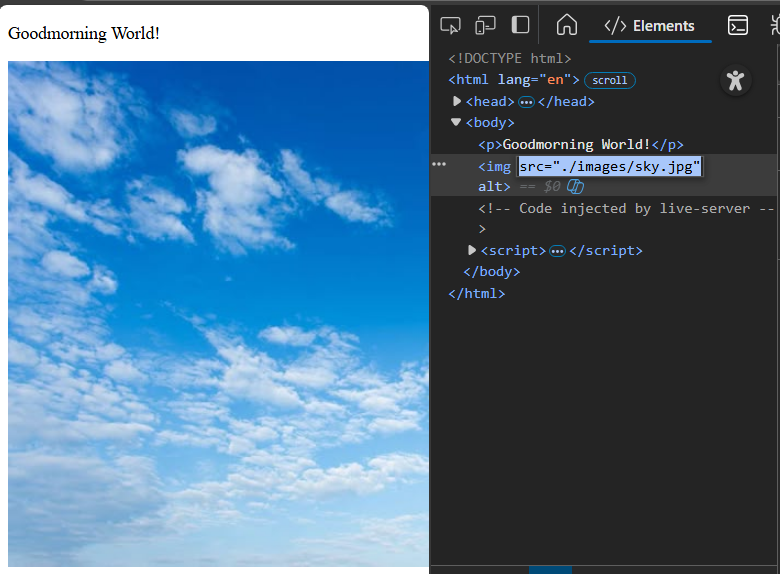
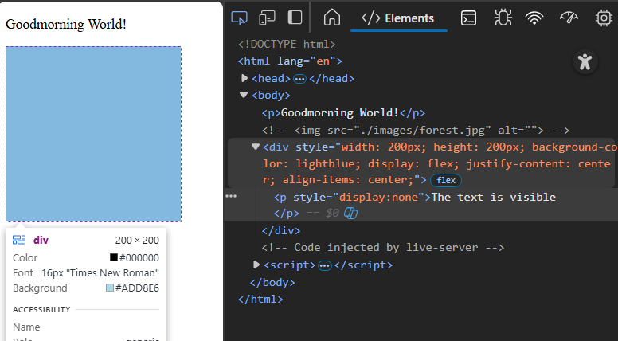
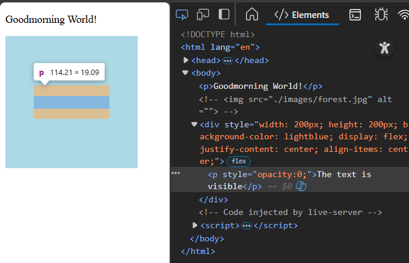
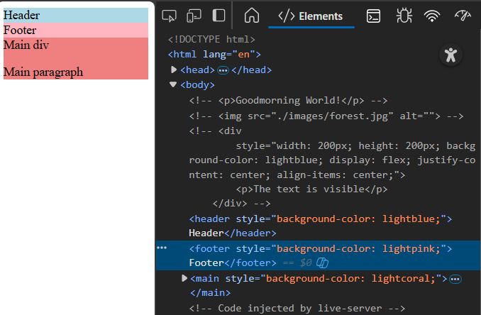
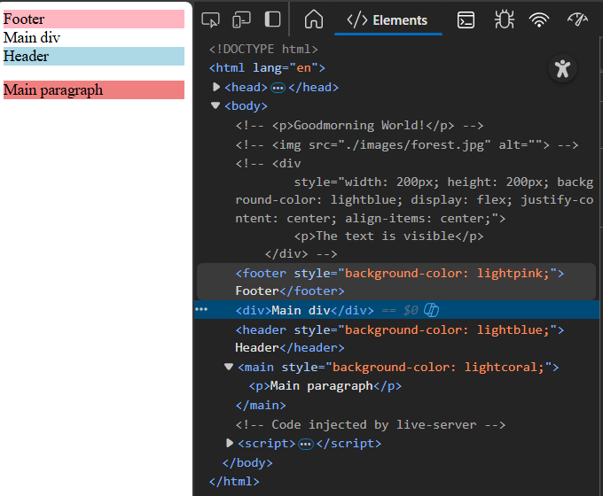
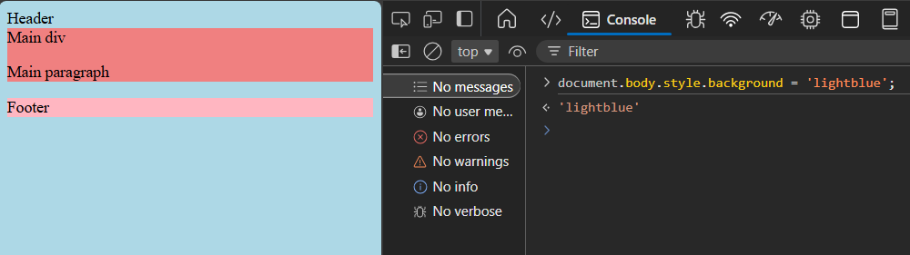
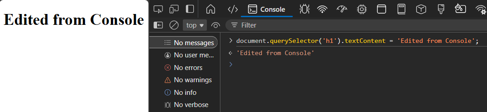

### Editing HTML Elements on a Live Page (via DevTools)

1. **Inspect and Edit Text Content**

2. **Learn to insert DOM elements using the Elements panel.**

3. **Modify Attributes (for eg, if its an img tag, then update its src tag)**

- Before:

- After:

4. **Use inline styles and CSS properties to manipulate visibility**

- Using display:none

- Using visibility:hidden

- Using opacity:0

5. **Edit HTML Structure**

- Before reordering

- After reordering

6. **Live Editing via Console**

- document.body.style.background = 'lightblue';

- document.querySelector('h1').textContent = 'Edited from Console';

7. **What’s the difference between editing HTML live vs editing source code?**

**Live HTML (DevTools)**
- Changes are temporary
- Used for debugging and live testing
- Affects only the browser, not the actual project
- Instant visual feedback without modifying files

**Source Code**
- Changes are permanent
- Modifies the actual project files
- Persists after reload and deployment

8. **Why do changes disappear after reload?**  
Changes made using Inspect / DevTools are temporary because they exist only in the browser’s memory (RAM).

9. **How can DevTools help debug layout or style issues?**  
DevTools helps debug layout and style issues by allowing developers to inspect, edit, and visualize CSS in real time.

**How DevTools helps debug layout/style issues**
- Inspect elements and their applied styles
- View CSS rules and computed values
- Check the box model for spacing and sizing issues
- Edit CSS live for instant testing
- Test responsiveness on different screen sizes